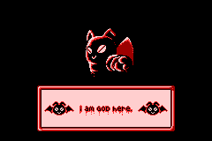
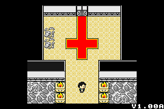

<html>

<body>

<h1 style="font-size:32pt">Misfortune Advance</h1>
<h3 style="font-size:24pt">A decent conversion of Misfortune.GB to the Game Boy Advance</h3>  

the port of misfortune to the PC was decent, but i wanted it on an actual Game Boy.
 

I think I did OK on it, but i made it like 2 years ago, and it definitely could be improved on.

 
 
 
 
<a href="../downloads/Misfortune Advance.gba">ROM Download</a> 
<a href="https://github.com/Sterophonick/Misfortune-Advance">Source Code</a> 
 
 
<a href="../archive">Go Back</a>

</body>
</html>