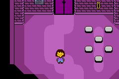
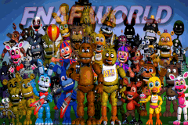

<html>
<body>
<h1>Undertale Tech Demo (Game Boy Advance)</h1>
<h3>A demo I made using HAM and a Windows XP Virtual Machine.</h3>  
 
<a href="../downloads/Undertale Tech Demo.gba">ROM Download</a> 
 
 
<h1>Fidget Spinner Simulator (Game Boy Advance)</h1>
<h3>Annoy your friends!</h3>  
 
<a href="../downloads/Fidget Spinner Simulator.gba">ROM Download</a> 
 
 
<h1>FNaF World Teaser Cycle (Game Boy Advance)</h1>
<h3>A really dumb demo I made in 2016 that is just a slideshow of various FNaF World teasers done in Mode 4.</h3>  

 
<a href="../downloads/FNaF World Teaser Cycle.gba">ROM Download</a> 
 
 
</body>
 
 
<a href="../archive">Go Back</a>
</html>