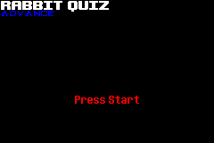
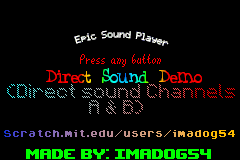

<html>
<body>
<h1>Some old stuff that doesn't really warrant its own page.</h1>

The source code for some of these was recovered from a Windows XP VM.
 
<h2>Undertale Tech Demo (Game Boy Advance)</h2>
<h3>A demo I made using HAM and a Windows XP Virtual Machine.</h3>  
 
<a href="../downloads/Undertale Tech Demo.gba">ROM Download</a> 

Source Code is lost...

 
 
<h2>Fidget Spinner Simulator (Game Boy Advance)</h2>
<h3>Annoy your friends!</h3>  
 
<a href="../downloads/Fidget Spinner Simulator.gba">ROM Download</a> 
<a href="../downloads/Fidget Spinner_src.zip">Source Code (For archival purposes)</a> 
 
 
<h2>FNaF World Teaser Cycle (Game Boy Advance)</h2>
<h3>A really dumb demo I made in 2016 that is just a slideshow of various FNaF World teasers done in Mode 4.</h3>  

 
<a href="../downloads/FNaF World Teaser Cycle.gba">ROM Download</a> 
<a href="../downloads/FNaFWorldTeaserCycle_src.zip">Source Code (For archival purposes)</a> 
 
 
<h2>FNaF GBA Teaser (Game Boy Advance)</h2>
<h3>One of the weakest demos I made, using Magic ARM Compiler. Just shows an image and thats it.</h3>  
 
<a href="../downloads/FNaF GBA Teaser.gba">ROM Download</a> 

Source Code is lost...

 
 
<h2>MegaDemo (Game Boy Advance)</h2>
<h3>A crappy demo I made because I was bored. Does more than just an image. More like demoscene stuff.</h3>  

 
<a href="../downloads/MegaDemo.gba">ROM Download</a> 
<a href="../downloads/MegaDemo_src.zip">Source Code (For archival purposes)</a> 
 
 
<h2>Corrupted Image (Game Boy Advance)</h2>
<h3>A crappy "demo" that I made back in early 2016 because I didn't know how Dovoto's pcx2gba program worked.</h3>  
 
<a href="../downloads/Corrupted Image.gba">ROM Download</a> 

Source Code is lost...

 
 
<h2>Cool Looking BG Plasma (Game Boy Advance)</h2>
<h3>A demo I made of palette cycling, using an asset from Super Block Jump.</h3>  
 
<a href="../downloads/Cool Looking BG Plasma (SBJ).gba">ROM Download</a> 

Source Code is lost...

 
 
<h2>Rabbit Quiz (Game Boy Advance)</h2>
<h3>A dumb quiz I made about rabbits in 2016 for a science class.</h3>  

Fun fact: I made this when I had no idea what I was doing with the GBA, and it literally took me months to get this to work.

 
<a href="../downloads/Rabbit Quiz.gba">ROM Download</a> 
<a href="../downloads/RabbitQuiz_src.zip">Source Code (For archival purposes)</a> 
 
 
<h2>Direct Sound Demo (Game Boy Advance)</h2>
<h3>A demo I made using code from 3DSage that will play a sound through DMA.</h3>  
 
<a href="../downloads/Direct Sound Demo.gba">ROM Download</a> 
<a href="../downloads/DirectSoundDemo_src.zip">Source Code (For archival purposes)</a> 
 
 
<h2>The Most Difficult Platformer Advance! Demo (Game Boy Advance)</h2>
<h3>A PoC of a game I made on Scratch back in 2015, reusing the physics engine from Super Block Jump.</h3>  
 
<a href="../downloads/The Most Difficult Platformer Ever Advance! Demo.gba">ROM Download</a> 

Source Code is lost...

<h3>However, there was also a demo that SCROLLED. It was made using HAM, and a Windows XP VM.</h3>  
 
<a href="../downloads/TMDPEA Scrolling Demo">ROM Download</a> 
<a href="../downloads/TMDPEAScroller_src.zip">Source Code (For archival purposes)</a> 
<a href="../downloads/The Most Difficult Platformer Ever!.sb2">Original Game (Broken in Scratch 3.0)</a> 
 
 
<h2>Pixel Color Detection Demo (Game Boy Advance)</h2>
<h3>A demo from 2016 that showcases the reading of VRAM so that color collision in the Bitmap modes is possible.</h3>  
 
<a href="../downloads/Pixel Color Detection.gba">ROM Download</a> 
<a href="../downloads/PixelColorDetect_src.zip">Source Code (For archival purposes)</a> 
</body>
 
 
<a href="../archive">Go Back</a>
</html>