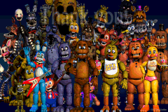

<html>
<body>
<h1>Some old stuff that doesn't really warrant its own page.</h1>

I have lost the source code to most, if not all, of this stuff. :(
 
<h2>Undertale Tech Demo (Game Boy Advance)</h2>
<h3>A demo I made using HAM and a Windows XP Virtual Machine.</h3>  
 
<a href="../downloads/Undertale Tech Demo.gba">ROM Download</a> 
 
 
<h2>Fidget Spinner Simulator (Game Boy Advance)</h2>
<h3>Annoy your friends!</h3>  
 
<a href="../downloads/Fidget Spinner Simulator.gba">ROM Download</a> 
 
 
<h2>FNaF World Teaser Cycle (Game Boy Advance)</h2>
<h3>A really dumb demo I made in 2016 that is just a slideshow of various FNaF World teasers done in Mode 4.</h3>  

 
<a href="../downloads/FNaF World Teaser Cycle.gba">ROM Download</a> 
 
 
<h2>FNaF GBA Teaser (Game Boy Advance)</h2>
<h3>One of the weakest demos I made, using Magic ARM Compiler. Just shows an image and thats it.</h3>  
 
<a href="../downloads/FNaF GBA Teaser.gba">ROM Download</a> 
 
 
<h2>MegaDemo (Game Boy Advance)</h2>
<h3>A crappy demo I made because I was bored. Does more than just an image. More like demoscene stuff.</h3>  

 
<a href="../downloads/MegaDemo.gba">ROM Download</a> 
 
 
<h2>Corrupted Image (Game Boy Advance)</h2>
<h3>A crappy "demo" that I made back in early 2016 because I didn't know how Dovoto's pcx2gba program worked.</h3>  
 
<a href="../downloads/Corrupted Image.gba">ROM Download</a> 
 
 
<h2>Cool Looking BG Plasma (Game Boy Advance)</h2>
<h3>A demo I made of palette cycling, using an asset from Super Block Jump.</h3>  
 
<a href="../downloads/Cool Looking BG Plasma (SBJ).gba">ROM Download</a> 
</body>
 
 
<a href="../archive">Go Back</a>
</html>