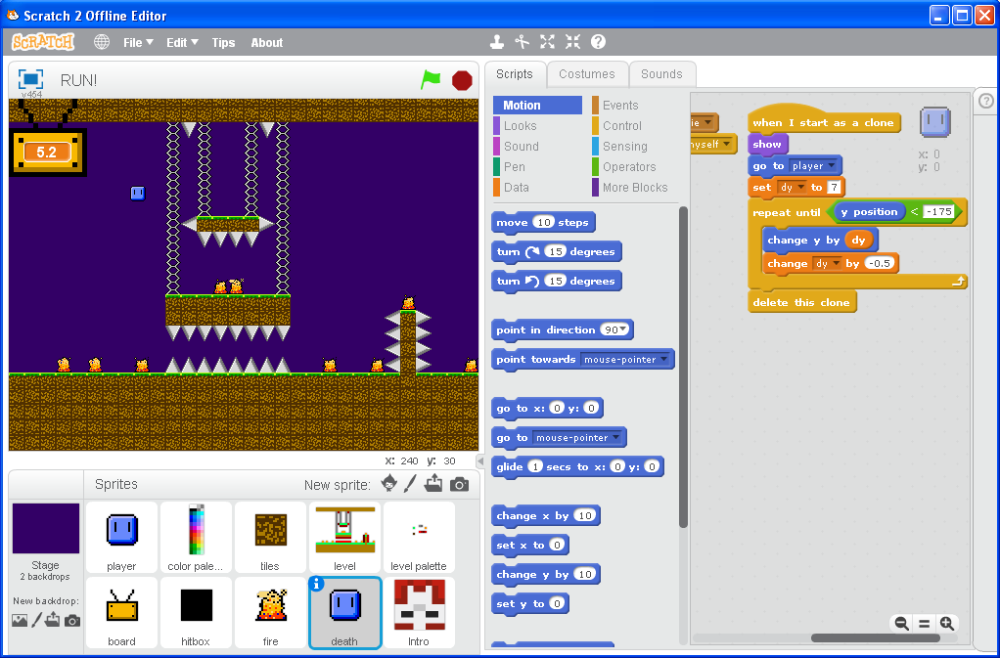
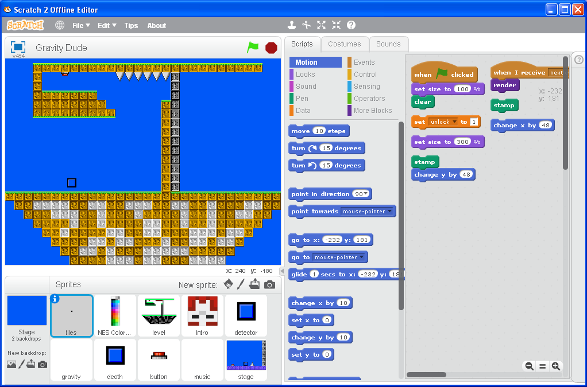
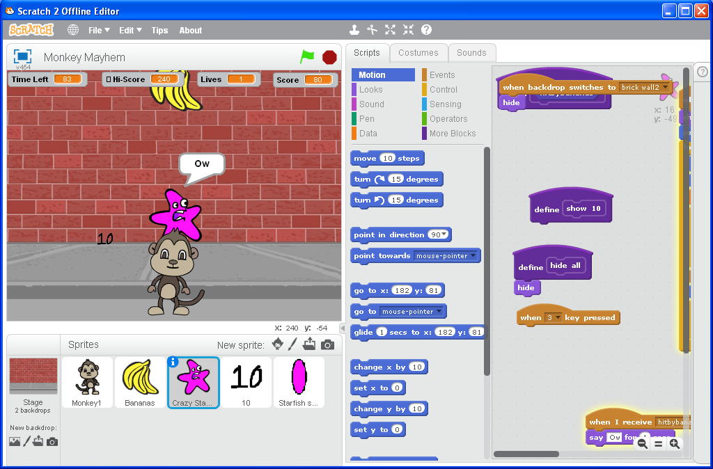

<html>

<body>

<h1 style="font-size:32pt">Backups of my old Scratch stuff.</h1>
<h3 style="font-size:24pt">SOME OF THESE PROJECTS DO NOT WORK ON SCRATCH 3.0!!!!!</h3>

also the intro to these is

 𝚌 𝚛 𝚒 𝚗 𝚐 𝚎 .

<h2 style="font-size:28pt">Wayback Machine Crawls of my profile</h2>
<a href="https://web.archive.org/web/20141020115214/http://scratch.mit.edu/users/imadog54/">October 20, 2014</a> 
<a href="https://web.archive.org/web/20150111055739/http://scratch.mit.edu:80/users/imadog54/">January 11, 2015</a> 
<a href="https://web.archive.org/web/20151206120448/https://scratch.mit.edu/users/imadog54/">December 6, 2015</a> 
<a href="http://web.archive.org/web/20200528234840/https://scratch.mit.edu/users/imadog54/">May 28, 2020</a> 
 
 
<h2 style="font-size:28pt">16-bit Platformer</h2>
<h3 style="font-size:24pt">A simple platformer that uses a tile system. Music by FearOfDark.</h3>
 
<a href="../downloads/16-bit Platformer.sb2">Scratch .sb2 Download</a> 
 
 
<h2 style="font-size:28pt">RUN!</h2>
<h3 style="font-size:24pt">A simple platformer where you have to complete the stage in the alotted time. Music by Danny B.</h3>
 
<a href="../downloads/RUN!.sb2">Scratch .sb2 Download</a> 
 
 
<h2 style="font-size:28pt">Gravity Dude</h2>
<h3 style="font-size:24pt">A simple platformer where you can flip gravity. Music by Disasterpeace.</h3>
 
<a href="../downloads/Gravity Dude.sb2">Scratch .sb2 Download</a> 
 
 
<h2 style="font-size:28pt">Monkey Mayhem</h2>
<h3 style="font-size:24pt">A simple arcade game about a monkey who must protect the city from flying starfish.</h3>

This game was in the book
<i>Help Your Kids With Computer Coding.</i>
 
<a href="../downloads/Monkey Mayhem.sb2">Scratch .sb2 Download</a> 
 
 
<a href="../archive">Go Back</a>

</body>
</html>