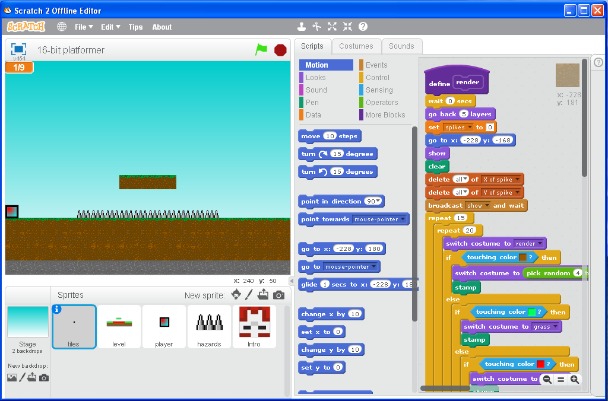

<html>

<body>
<h1>Backups of my old Scratch stuff.</h1>
<h2>Wayback Machine Crawls of my profile</h2>
<a href="https://web.archive.org/web/20141020115214/http://scratch.mit.edu/users/imadog54/">October 20, 2014</a> 
<a href="https://web.archive.org/web/20150111055739/http://scratch.mit.edu:80/users/imadog54/">January 11, 2015</a> 
<a href="https://web.archive.org/web/20151206120448/https://scratch.mit.edu/users/imadog54/">December 6, 2015</a> 
<a href="http://web.archive.org/web/20200528234840/https://scratch.mit.edu/users/imadog54/">May 28, 2020</a> 
 
 
<h2>16-bit Platformer</h2>
<h3>A simple platformer that uses a tile system. Music by FearOfDark.</h3>
 
<a href="../downloads/16-bit Platformer.sb2">Scratch .sb2 Download</a> 
</body>
 
 
<a href="../archive">Go Back</a>
</html>