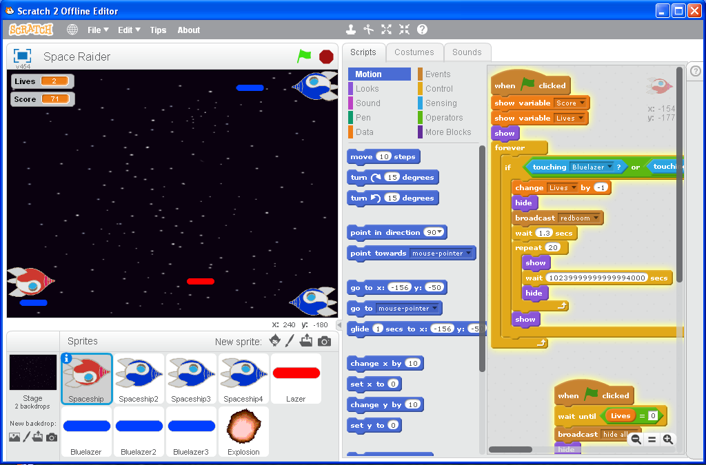
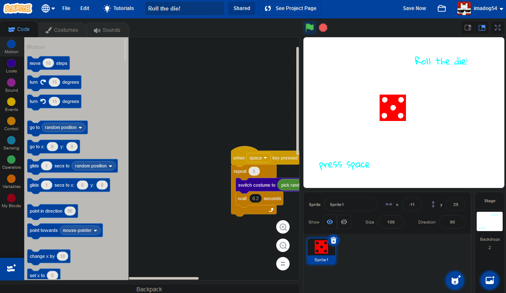
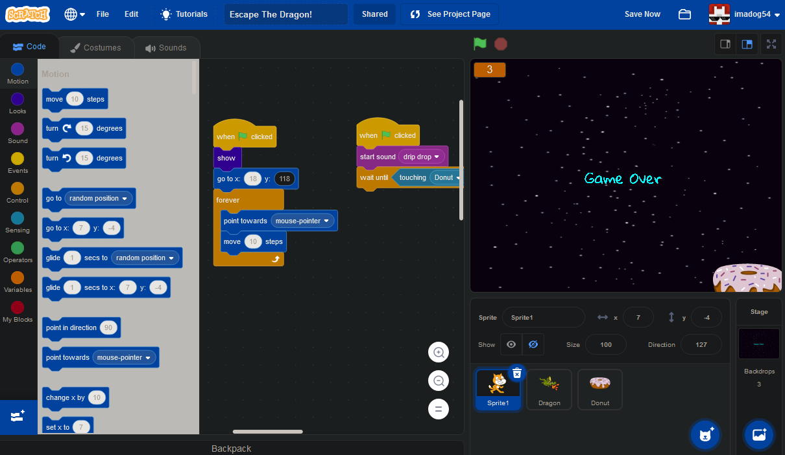
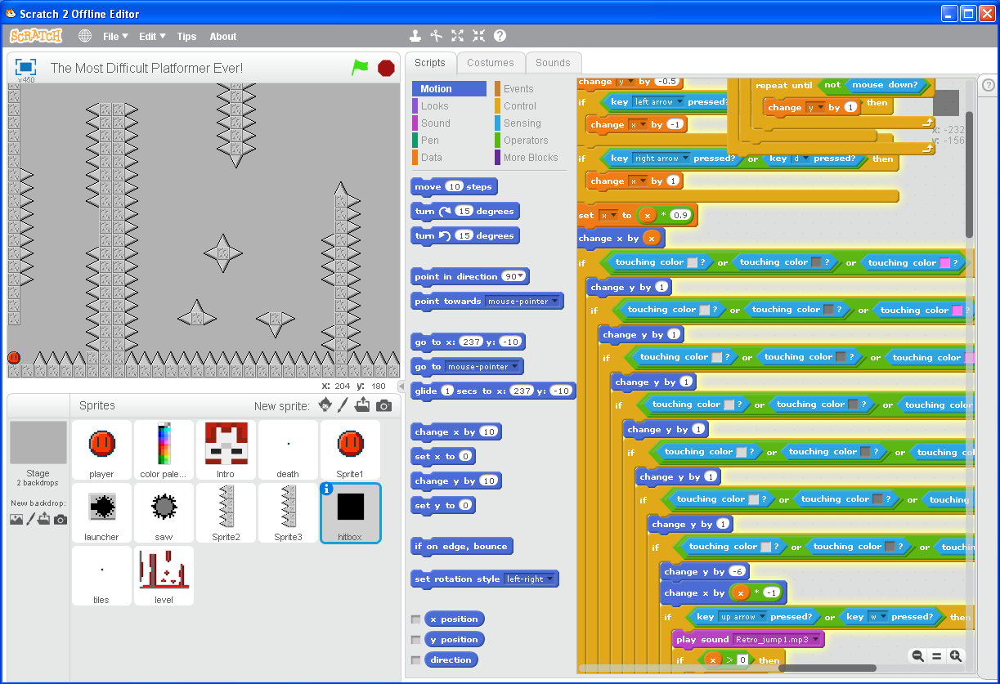

<html>

<body>

<h1 style="font-size:32pt">Backups of my old Scratch stuff.</h1>
<h3 style="font-size:24pt">SOME OF THESE PROJECTS DO NOT WORK ON SCRATCH 3.0!!!!!</h3>
also the intro to these is <marquee width="10%">cringe</marquee> 
<h2 style="font-size:28pt">Wayback Machine Crawls of my profile</h2>
<a href="https://web.archive.org/web/20141020115214/http://scratch.mit.edu/users/imadog54/">October 20, 2014</a> 
<a href="https://web.archive.org/web/20150111055739/http://scratch.mit.edu:80/users/imadog54/">January 11, 2015</a> 
<a href="https://web.archive.org/web/20151206120448/https://scratch.mit.edu/users/imadog54/">December 6, 2015</a> 
<a href="https://web.archive.org/web/20200530223544/https://scratch.mit.edu/users/imadog54/">May 30, 2020</a> 
 
 
<h2 style="font-size:28pt">16-bit Platformer</h2>
<h3 style="font-size:24pt">A simple platformer that uses a tile system. Music by FearOfDark.</h3>
 
<a href="ScratchGames/16BitPlatformer">Play Game</a> 
<a href="../downloads/16-bit platformer.sb2">Scratch .sb2 Download</a> 
 
 
<h2 style="font-size:28pt">RUN!</h2>
<h3 style="font-size:24pt">A simple platformer where you have to complete the stage in the alotted time. Music by Danny B.</h3>
 
<a href="ScratchGames/RUN!">Play Game</a> 
<a href="../downloads/RUN!.sb2">Scratch .sb2 Download</a> 
 
 
<h2 style="font-size:28pt">Gravity Dude</h2>
<h3 style="font-size:24pt">A simple platformer where you can flip gravity. Music by Disasterpeace.</h3>
 
<a href="ScratchGames/GravityDude">Play Game</a> 
<a href="../downloads/Gravity Dude.sb2">Scratch .sb2 Download</a> 
 
 
<h2 style="font-size:28pt">Monkey Mayhem</h2>
<h3 style="font-size:24pt">A simple arcade game about a monkey who must protect the city from flying starfish.</h3>

This game was in the book <i>Help Your Kids With Computer Coding</i>.

 
<a href="ScratchGames/MonkeyMayhem">Play Game</a> 
<a href="ScratchGames/MonkeyMayhemAlt">Play Alternate Version</a> 
<a href="../downloads/Monkey Mayhem.sb2">Scratch .sb2 Download</a> 
<a href="../downloads/Monkey Mayhem Advance.gba">Game Boy Advance ROM</a> 
<a href="https://github.com/Sterophonick/Monkey-Mayhem-Advance">Game Boy Advance Source Code</a> 
 
 
<h2 style="font-size:28pt">Space Raider</h2>
<h3 style="font-size:24pt">A simple arcade shooter.</h3>
 
<a href="ScratchGames/SpaceRaider">Play Game</a> 
<a href="../downloads/Shoot the rockets.sb2">August 24, 2014 10:10 AM Prototype Download</a> 
<a href="../downloads/Space Raider.sb2">Scratch 2.0 .sb2 Download</a> 
<a href="../downloads/Space Raider.sb3">Scratch 3.0 .sb3 Download</a> 
 
 
<h2 style="font-size:28pt">Roll the die!</h2>
<h3 style="font-size:24pt">Roll the die!</h3>
 
<a href="ScratchGames/Rollthedie!">Roll the die!</a> 
<a href="../downloads/Roll the die!.sb2">Scratch 2.0 .sb2 Download</a> 
<a href="../downloads/Roll the die!.sb3">Scratch 3.0 .sb3 Download</a> 
 
 
<h2 style="font-size:28pt">Escape the Dragon!</h2>
<h3 style="font-size:24pt">Use the mouse to guide the cat away from the dragon!</h3>
 
<a href="ScratchGames/EscapetheDragon!">Play Game</a> 
<a href="../downloads/Escape the Dragon!.sb2">Scratch 2.0 .sb2 Download</a> 
<a href="../downloads/Escape the Dragon!.sb3">Scratch 3.0 .sb3 Download</a> 
 
 
<h2 style="font-size:28pt">The Most Difficult Platformer Ever!</h2>
<h3 style="font-size:24pt">A super difficult platformer following Super Meat Boy</h3>
 
<a href="ScratchGames/TMDPE">Play Game</a> 
<a href="../downloads/The Most Difficult Platformer Ever!.sb2">Scratch 2.0 .sb2 Download</a> 
 
 
<a href="../archive">Go Back</a>

</body>
</html>