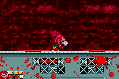

<html>

<body>

<h1 style="font-size:32pt">onic.EXE (Game Boy Advance)</h1>
<h3 style="font-size:24pt">A crappy conversion of MY5TCrimson's Sonic.EXE fan remake to the Nintendo Game Boy Advance.</h3>  

I hate this code now. 
It was so lazily done and rushed. 

 
 
 
 
<a href="../downloads/Sonic.EXE.gba">ROM Download</a> 
<a href="https://github.com/Sterophonick/Sonic.EXE-GBA">Source Code (For archival purposes)</a> 
 
 
<a href="../archive">Go Back</a>

</body>
</html>