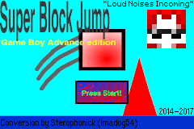
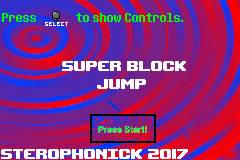
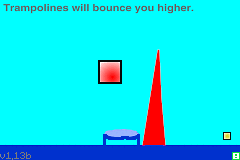
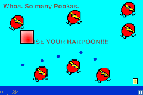
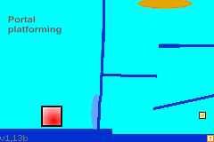
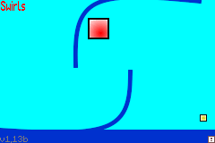
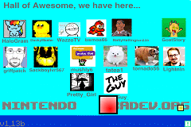
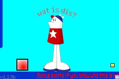

<html>
<body>
<h1>Super Block Jump</h1>
<h3>A game for the Nintendo Game Boy Advance that is a port of a Scratch game I made back in late 2014.</h3>  

A platformer with a very simple goal in mind, to get to the goal on the right side of the screen.

<a href="../downloads/Super Block Jump - Game Boy Advance Edition.gba">ROM Download</a> 
<a href="https://github.com/Sterophonick/SuperBlockJumpGBA">Source Code</a> 
 
<a href../downloads/Super Block Jump.sb3">Original Game</a> 
<a href="../downloads/Super Block Jump (A LONG platforming game).sb2">A prototype of the Scratch version, as of 12:30 PM, 2/22/2015.</a> 

 
 

Apparently, I was also really good at backing up old versions of this because I managed to dig up like 5 versions of the source code.

<a href="../downloads/SbjGbaIntro_src.zip">A version of the Intro demo + Source code</a> 
<a href="../downloads/SbjGbaSourceCode4_2016.zip">A copy of the source code from April 2016 (WARNING: This code is HORRENDOUS)</a> 
<a href="../downloads/SbjGba2016src.zip">A copy of the source code from August 2016 (WARNING: This code is also HORRENDOUS)</a> 
<a href="../downloads/SbjGba03_2017_src.zip">The source code from March 2017. (THIS DOES NOT COMPILE)</a> 
<a href="../downloads/SbjGba2017.zip">The ROM + Source code from when it released on Scratch on May 11, 2017.</a> 
</body>
 
 
<a href="../archive">Go Back</a>
</html>