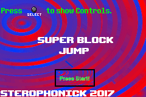

<html>
<body>
<h1>Super Block Jump</h1>
<h3>A game for the Nintendo Game Boy Advance that is a port of a Scratch game I made back in late 2014.</h3>  

<a href="../downloads/Super Block Jump - Game Boy Advance Edition.gba">ROM Download</a> 
<a href="https://github.com/Sterophonick/SuperBlockJumpGBA">Source Code</a> 
 
<a href="https://scratch.mit.edu/projects/33047346">Original Game</a> 
 
 
<a href="../downloads/SbjGbaSourceCode4_2016.zip">A copy of the source code from April 2016 (WARNING: This code is HORRENDOUS)</a> 
<a href="../downloads/SbjGba2016src.zip">A copy of the source code from August 2016 (WARNING: This code is also HORRENDOUS)</a> 
<a href="../downloads/SbjGba2017.zip">The ROM + Source code from when it released on Scratch on May 11, 2017.</a> 
</body>
 
 
<a href="javascript:history.back()">Go Back</a>
</html>