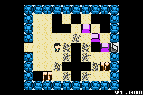
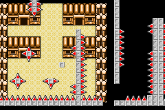
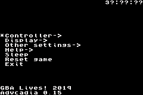

<html>

<body>
<h1 style="font-size:32pt">HeartLib</h1>

A Game Boy Advance development library inspired by HAMLib and HELlib.
  

 

HeartLib supports most functions of the Nintendo Game Boy Advance, with the exception of Serial I/O.

It even supports some undocumented features such as SWI 0x26 (HardReset) or the Green Swap (?) register!

It has powered some of my Game Boy Advance homebrews such as Super Block Jump and Misfortune Advance, along with Chip8Adv and Advcadia, my RCA CHIP-8 and Emerson Arcadia 2001 emulators respectively.

<a href="https://github.com/Sterophonick/HeartLib">GitHub Repository</a> 
 
<h1 style="font-size:32pt">AGB_Lib</h1>

AGB_Lib was a crappy library that I made based on gba.h by eloist from 2001. It has some of the most pointless functions in the world, such as one that will add numbers together. It was the predecessor to HeartLib, and HeartLib still has some of its DNA.

<a href="downloads/agb_lib.h">AGB_Lib download (For archival purposes)</a> 
 
 
<a href="..">Go Back</a> 

</body>
</html>