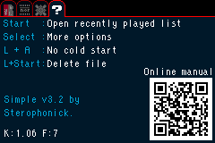
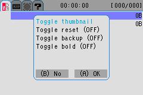

<html>
<body>
<h1>Simple</h1>
<h3>A new kernel for your EZ-Flash Omega</h3> 

Simple comes with loads of new options and plugins from the era of PogoShell (remember when that was popular? :) ).

It also comes with a new theme that in my opinion looks better than the stock firmware.

Using this kernel you can view images, listen to music, read text documents, and play many more systems such as the Sega Master System for Sinclair ZX Spectrum!

Screenshots:

 

 
<a href="omegamanual.html">Simple-specific EZ-Flash Omega Manual</a> 
<a href="https://gbatemp.net/threads/new-theme-for-ez-flash-omega.520665/page-15">GBAtemp thread</a> 
</body>
 
 
<a href="javascript:history.back()">Go Back</a>
</html>